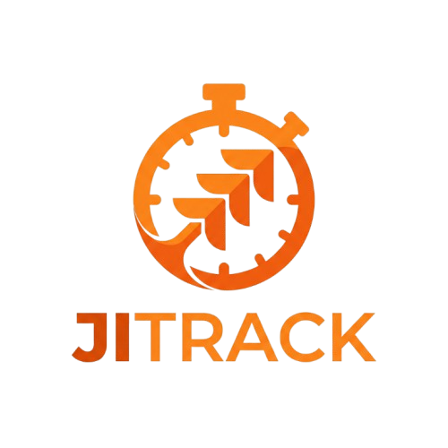

# JITRACK

Professional time tracking for JIRA. Desktop application built with Go, Wails v2, Svelte and SQLite.



## Features

- ⏱️ **Live Timer** - Track time with precision, auto-save on exit
- 📊 **Dashboard** - Visual overview of tasks with progress bars
- 📋 **Task Management** - Organize and manage JIRA tasks
- 📈 **Daily Reports** - Analyze your time tracking data with charts
- 🔗 **Chrome Extension** - One-click export from JIRA tickets
- 🌙 **Dark & Light Mode** - Choose your preferred theme

## Download

Pre-built binaries are available in [GitHub Releases](https://github.com/porebski-development/jitrack/releases).

### Latest Versions

- **macOS (Apple Silicon)**: `JITRACK-macOS-arm64.zip`
- **Windows (x64)**: `JITRACK-Windows-amd64.exe`

## Chrome Extension

Get the Chrome Extension from: [jitrack-chrome-extension](https://github.com/porebski-development/jitrack-chrome-extension)

The extension adds an "Export to JITRACK" button to JIRA ticket pages for seamless task import.

## Build from Source

### Prerequisites

- [Go 1.24+](https://go.dev/dl/)
- [Wails CLI v2.11+](https://wails.io/docs/gettingstarted/installation)
- [Node.js 20+](https://nodejs.org/)

### Installation

```bash
# Clone repository
git clone https://github.com/porebski-development/jitrack.git
cd jitrack

# Install frontend dependencies
cd frontend && npm install
cd ..

# Run in development mode
wails dev
```

### Build for Production

```bash
# macOS (Apple Silicon)
wails build -platform darwin/arm64 -ldflags "-s -w"

# Windows (x64)
wails build -platform windows/amd64 -ldflags "-s -w"

# Linux (x64)
wails build -platform linux/amd64 -ldflags "-s -w"
```

Build outputs will be in `build/bin/` directory.

## Automatic Releases

This repository includes GitHub Actions workflow that automatically builds release binaries when you push a tag:

```bash
# Create and push a new tag
git tag -a v2.0.0 -m "Release version 2.0.0"
git push origin v2.0.0
```

GitHub Actions will build binaries for macOS and Windows and create a new release.

## Tech Stack

- **Backend**: Go 1.24
- **Framework**: [Wails](https://wails.io/) v2.11
- **Frontend**: Svelte + TypeScript + Tailwind CSS
- **Database**: SQLite (CGO-free, modernc.org/sqlite)
- **Build Tool**: Vite

## Project Structure

```
jitrack/
├── app.go                 # Main application logic
├── main.go                # Entry point
├── internal/              # Internal packages
│   ├── db/               # Database models and operations
│   ├── models/           # Data models
│   ├── server/           # HTTP server for Chrome extension
│   └── timer/            # Timer functionality
├── frontend/              # Frontend code
│   ├── src/              # Svelte components and stores
│   ├── public/           # Static assets (logo, etc.)
│   └── wailsjs/          # Auto-generated Wails bindings
├── build/                 # Build configuration and outputs
└── .github/workflows/     # CI/CD workflows
```

## Development

### Live Development Mode

```bash
wails dev
```

This runs a Vite development server with hot reload. The app will automatically reload when you make changes to the frontend code.

### Generate Wails Bindings

If you add new Go methods that need to be called from frontend:

```bash
wails generate bindings
```

### Database Location

The SQLite database is stored in:
- **macOS**: `~/Library/Application Support/JITRACK/`
- **Windows**: `%APPDATA%/JITRACK/`
- **Linux**: `~/.local/share/JITRACK/`

## Versioning

Version is automatically set during build from git tags via ldflags. The version is displayed in the application sidebar.

## License

MIT License

## Links

- [Landing Page](https://your-landing-page-url.com)
- [Chrome Extension Repository](https://github.com/porebski-development/jitrack-chrome-extension)
- [Issues](https://github.com/porebski-development/jitrack/issues)
